# Problem 1
These cameras are 1944x2592 with 59FPS.The resolution is too high, but the speed is too low.

I tried to apply a ROI binning to disable some pixels on the CMOS. But it will hurt the view filed of the camera.
<p float="left">
  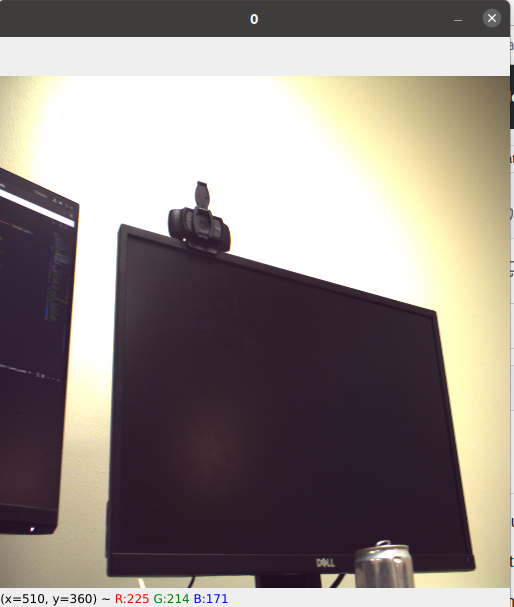
  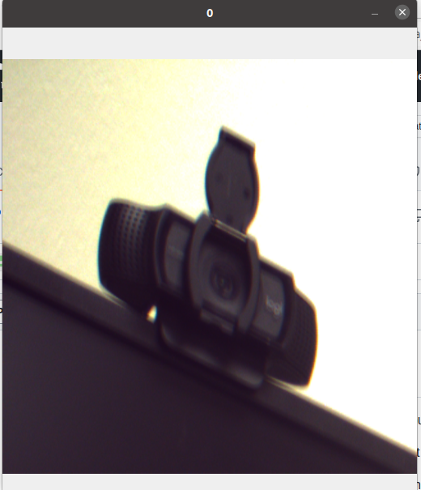 
</p>

We need to buy new cameras if we can not low down the resolution of the CMOS without view filed reduction. 
# Problem 2
Mutil-cameres are hard to parallel, beacuse they will share the exposure time. 

Despite the read time, the speed:
one_cam = four_cams (single_processor) = four_cams (Mutil_processors)
### 486x648 resolution 
#### exposure time = 1ms
one_cam < four_cams (single_processor) = four_cams (Mutil_processors)
<p float="left">
  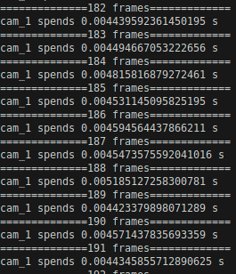
  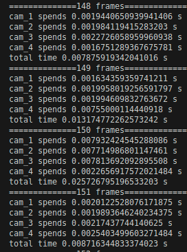 
  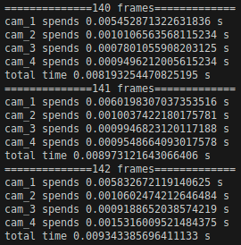
</p>

#### exposure time = 10ms
one_cam = four_cams (single_processor) = four_cams (Mutil_processors)
<p float="left">
  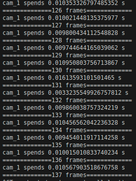
  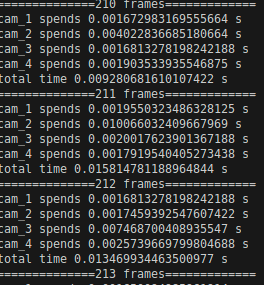 
  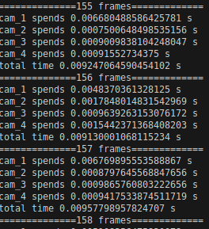
</p>

#### exposure time = 50ms
one_cam = four_cams (single_processor) = four_cams (Mutil_processors)
<p float="left">
  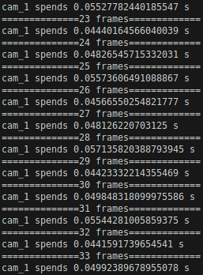
  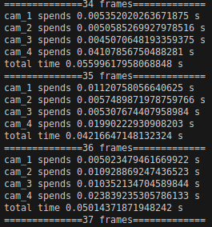 
  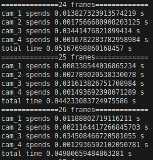
</p>

#### exposure time = 100ms
one_cam vs four_cams (single_processor) vs four_cams (Mutil_processors)
<p float="left">
  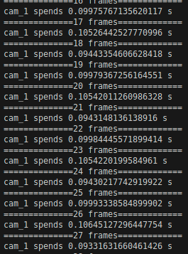
  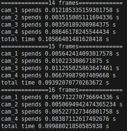 
  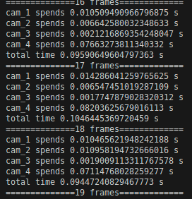
</p>

### 1944x2592 resolution
#### exposure time = 1ms
one_cam < four_cams (single_processor) > four_cams (Mutil_processors)
<p float="left">
  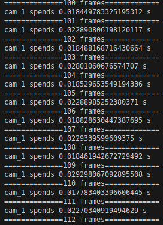
  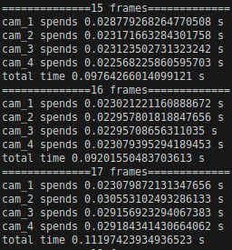 
  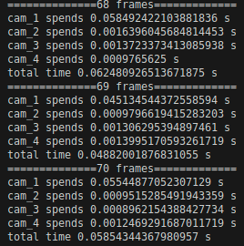
</p>

#### exposure time = 10ms
one_cam < four_cams (single_processor) > four_cams (Mutil_processors)
<p float="left">
  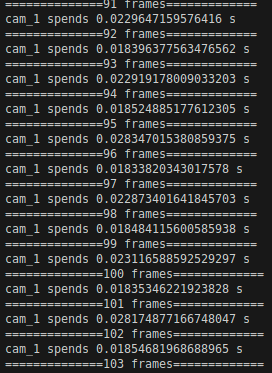
  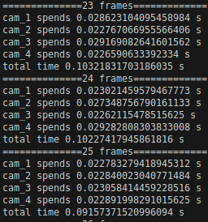 
  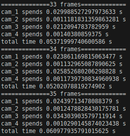
</p>

#### exposure time = 50ms
one_cam < four_cams (single_processor) > four_cams (Mutil_processors)
<p float="left">
  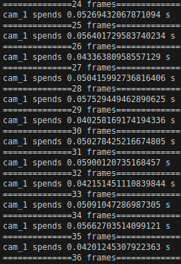
  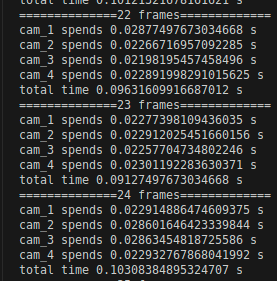 
  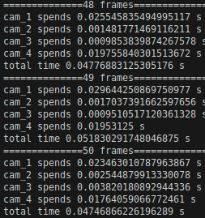
</p>

#### exposure time = 100ms
one_cam < four_cams (single_processor) = four_cams (Mutil_processors)
<p float="left">
  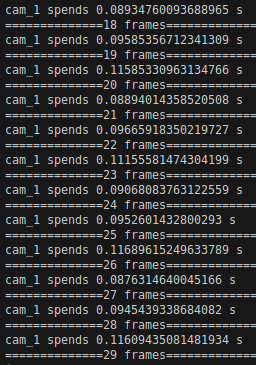
  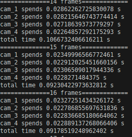 
  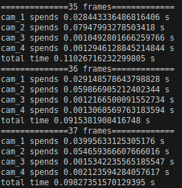
</p>


# camera install
1.Download camera driver [MVSDK.zip](https://drive.google.com/file/d/1j-rIynNE2H0fEiB5_p_kHR1icWd3h4Wo/view?usp=sharing)

2.Install the driver
```bash
unzip MVSDK.zip
cd MVSDK
sudo ./install.sh
```
Please refer to MVSDK/LinuxSDK Document.pdf if you meet any problem while installing.

3.To access the camera dirver, you need add "sudo" for every run. such as
```bash
sudo python cam.py
```
For convenient, you can add current user to the root to avoid add "sudo" for every time.

```bash
secUser=`who am i | awk '{print $1}'` 
sudo adduser $secUser root
sudo udevadm control --reload
sudo udevadm trigger
```
